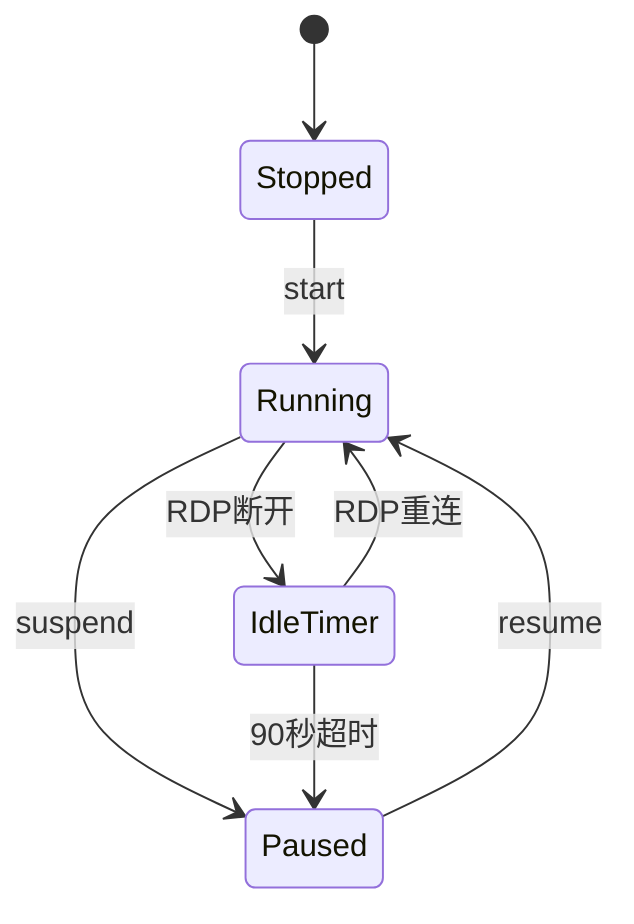

# WinStart

> PVE Windows 虚拟机远程唤醒系统（Final Stable）

一个基于 **PVE 官方 API + Ubuntu 网关 + Windows 事件通知** 的远程唤醒系统。

## 功能

- 📱 iPhone 打开 Microsoft Windows App 自动唤醒
- 💻 Windows 一键启动 WinStart.exe 自动唤醒
- ⚡ PVE Resume 秒恢复（2~3 秒）
- 😴 RDP 断开 90 秒自动挂起
- 🔒 PVE 管理端口无需暴露公网
- 🚫 不使用 Wake-on-LAN
- 🚫 不依赖 QEMU Guest Agent

---

## 整体架构

```text
                    公网
                     │
             win.1223.fun:3400
                     │
              Nginx 反向代理
                     │
        Ubuntu（192.168.1.10）
        ┌────────────────────┐
        │ WinStart (Node.js) │
        │ Express API        │
        │ systemd 守护       │
        └────────────────────┘
                     │
          PVE API Token 认证
                     │
          PVE（192.168.1.4）
                     │
         Windows VM（VMID=101）
```

入口有两个：

| 客户端 | 功能 |
|--------|------|
| 📱 Microsoft Windows App | 自动 POST 唤醒 |
| 💻 WinStart.exe | 一键唤醒 |

---

## 技术栈

### 服务端

| 软件 | 用途 |
|------|------|
| Ubuntu 26.04 | 网关 |
| Node.js 22 | WinStart |
| Express | HTTP API |
| systemd | 服务守护 |
| curl | 调用 PVE API |
| jq | JSON 解析 |

### 虚拟化

| 软件 | 用途 |
|------|------|
| PVE 8 | 虚拟化 |
| QEMU | Resume/Suspend |
| API Token | 权限认证 |

### 客户端

| 软件 | 用途 |
|------|------|
| Microsoft Windows App | 手机远程桌面 |
| iPhone 快捷指令 | 自动 POST |
| Electron | WinStart.exe |

---

## 网络信息

| 项目 | 值 |
|------|----|
| PVE | `192.168.1.4` |
| Ubuntu | `192.168.1.10` |
| VMID | `101` |
| Node | `pve` |
| WinStart | `3400` |
| 域名 | `win.1223.fun` |

---

## 项目目录

```text
/opt/
└── winstart/
    ├── server.js
    ├── package.json
    ├── .env
    └── node_modules/
```

systemd：

```text
/etc/systemd/system/
└── winstart.service
```

推荐未来统一目录：

```text
/opt/
├── winstart/
├── stacks/
│   ├── dpanel/
│   ├── rtp2httpd/
│   ├── uptime-kuma/
│   └── ...
├── backup/
└── scripts/
```

原则：

- WinStart 永远用 systemd。
- 其它服务全部 Docker。

---

## 环境变量（.env）

路径：

```text
/opt/winstart/.env
```

内容：

```env
PORT=3400

PVE_HOST=https://192.168.1.4
PVE_NODE=pve
VMID=101

PVE_TOKEN_ID=root@pam!win-start
PVE_TOKEN_SECRET=YOUR_PVE_SECRET

API_TOKEN=YOUR_API_TOKEN
```

---

## PVE API Token

创建位置：

> Datacenter → Permissions → API Tokens

Token：

```text
root@pam!win-start
```

权限：

- VM.PowerMgmt
- VM.Audit

---

## WinStart API

所有请求：

```http
Authorization: Bearer YOUR_API_TOKEN
```

接口：

| 方法 | 地址 | 功能 |
|------|------|------|
| POST | `/api/wake` | 唤醒 |
| POST | `/api/idle` | 开始倒计时 |
| POST | `/api/cancel-idle` | 取消倒计时 |
| GET | `/` | 健康检查 |

---

## 唤醒逻辑

```text
查询 PVE
        ↓
qmpstatus=paused → resume
qmpstatus=stopped → start
qmpstatus=running → 返回成功
```

判断依据必须是 **`qmpstatus`**。

---

## 自动挂起逻辑

最终版完全放弃 Guest Agent，采用 **Windows 主动通知 Ubuntu**。

```text
RDP断开
    ↓
Windows任务计划
    ↓
POST /api/idle
    ↓
Node启动90秒Timer
    ↓
没人连接
    ↓
POST status/suspend
```

重新连接：

```text
RDP连接
      ↓
POST /api/cancel-idle
      ↓
clearTimeout()
```

---

## Windows 任务计划

| 名称 | 触发 |
|------|------|
| Win1223 Idle | RDP断开 |
| Win1223 Resume | RDP重连 |
| Win1223 Startup Sync | Windows启动 |

---

## iPhone 自动化

打开 Microsoft Windows App 后自动执行：

```http
POST https://win.1223.fun:3400/api/wake
Authorization: Bearer YOUR_API_TOKEN
```

---

## WinStart.exe（Electron）

未来 Windows 客户端采用 Electron。

```text
WinStart.exe
      ↓
POST /api/wake
      ↓
打开远程桌面
```

---

## systemd 配置

关键参数：

```ini
Restart=always
RestartSec=3
WorkingDirectory=/opt/winstart
```

常用命令：

```bash
sudo systemctl restart winstart
sudo systemctl status winstart
journalctl -u winstart -f
```

---

## 状态机



---

## 安全设计

公网只开放：

```text
win.1223.fun:3400
```

PVE 的 `8006` 不暴露公网。

---

## 踩坑记录

| 坑 | 最终方案 |
|----|---------|
| `status=running` 判断错误 | 改用 `qmpstatus` |
| Guest Agent 中文乱码 | 放弃 |
| `qwinsta` GBK 编码 | 放弃 |
| conntrack 检测失败 | 放弃 |
| Timer 竞态 | `idleToken` |
| 重复点击 | `wakeLock` |
| Node 崩溃 | systemd |
| Ubuntu 时间 UTC | `timedatectl set-timezone Asia/Shanghai` |
| Windows 重启不同步 | Startup Sync |

---

## 灾难恢复

### Ubuntu 重装

1. 安装 Node。
2. 恢复 `/opt/winstart`。
3. 恢复 `.env`。
4. 恢复 `winstart.service`。
5. `systemctl enable --now winstart`。

### Windows 重装

- 开启 RDP。
- 创建三个任务计划。

### PVE 重装

- 导入 VM。
- 创建 API Token。
- 修改 `.env`。

---

## 恢复速度原理

采用：

```text
PVE Suspend
```

恢复：

```text
Resume
```

恢复速度约 **2~3 秒**。

---

## Version History

```text
v1.0
- 完成 PVE API 唤醒

v1.1
- 修复 qmpstatus 判断

v1.2
- 移除 Guest Agent

v1.3
- 加入 idleToken

v1.4（当前稳定版）
- systemd 自恢复
- Windows Startup Sync
- iPhone 自动化
- Electron 客户端方案确定
```

---

## 致未来的自己

重装服务器时，按这个顺序恢复：

1. PVE API Token
2. Ubuntu `/opt/winstart`
3. `.env`
4. `systemd`
5. Windows 三个任务计划
6. iPhone 自动化

**核心原则：**

> Windows 负责通知，Ubuntu 负责逻辑，PVE 负责执行。
