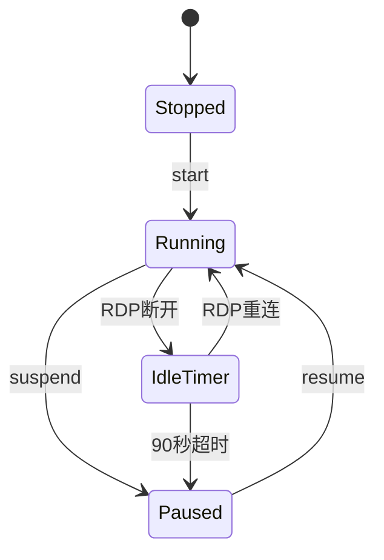

# WinStart

<p align="center">
  
</p>

<h1 align="center">WinStart</h1>

<p align="center">
  PVE Windows 虚拟机远程唤醒系统（Final Stable）
</p>

<p align="center">
  
  
  
  
  
</p>

---

## ✨ 功能

- 📱 打开 Microsoft Windows App 自动唤醒
- 💻 WinStart.exe 一键唤醒
- ⚡ PVE Resume 秒恢复（2~3 秒）
- 😴 RDP 断开 90 秒自动挂起
- 🔒 PVE 管理端口无需暴露公网
- 🚫 不使用 Wake-on-LAN
- 🚫 不依赖 QEMU Guest Agent

---

## 架构图


---

## 状态机



---

## 项目结构

```text
WinStart/
├── README.md
├── CHANGELOG.md
├── LICENSE
├── .gitignore
├── docs/
│   ├── Architecture.md
│   ├── Deployment.md
│   ├── PVE.md
│   ├── Windows.md
│   ├── iPhone.md
│   └── Troubleshooting.md
└── assets/
    ├── logo.svg
    ├── architecture.svg
    └── flow.svg
```

---

## 快速部署

1. Ubuntu 安装 Node.js
2. 创建 `/opt/winstart`
3. 配置 `.env`
4. 创建 PVE API Token
5. 安装 `winstart.service`
6. Windows 创建三个任务计划
7. iPhone 自动化完成配置

详细步骤请查看：

- [部署指南](docs/Deployment.md)
- [PVE 配置](docs/PVE.md)
- [Windows 配置](docs/Windows.md)
- [iPhone 自动化](docs/iPhone.md)
- [故障排查](docs/Troubleshooting.md)

---

## 当前架构

| 组件 | 技术 |
|------|------|
| 服务端 | Node.js + Express |
| 服务管理 | systemd |
| 虚拟化 | PVE |
| 客户端 | Windows App + Electron |
| 自动化 | Windows Task Scheduler |

---

## License

MIT

---

> 最后更新：2026-09-29
